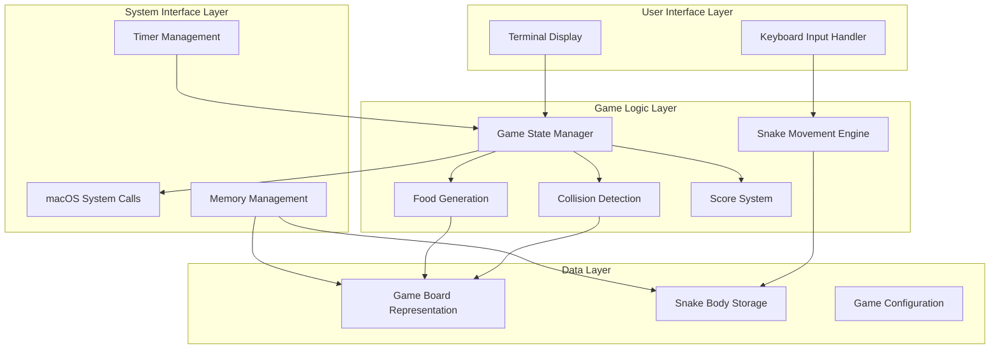
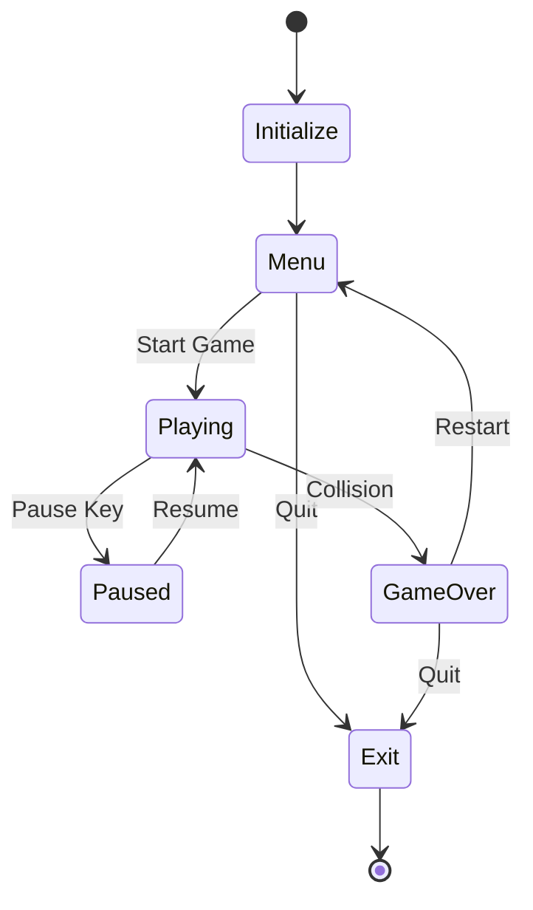
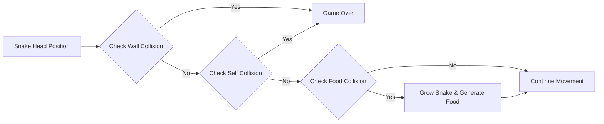
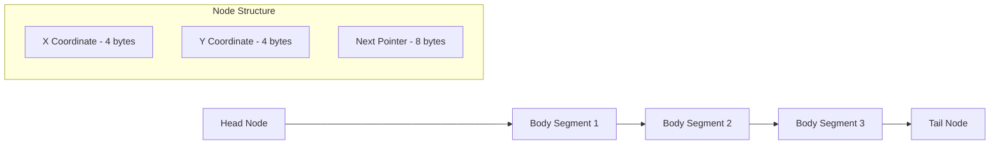
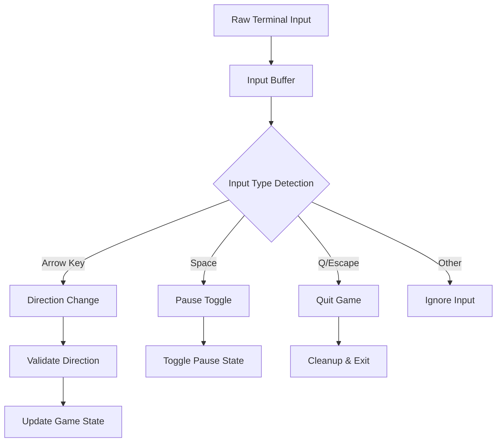
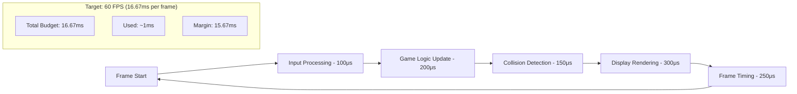
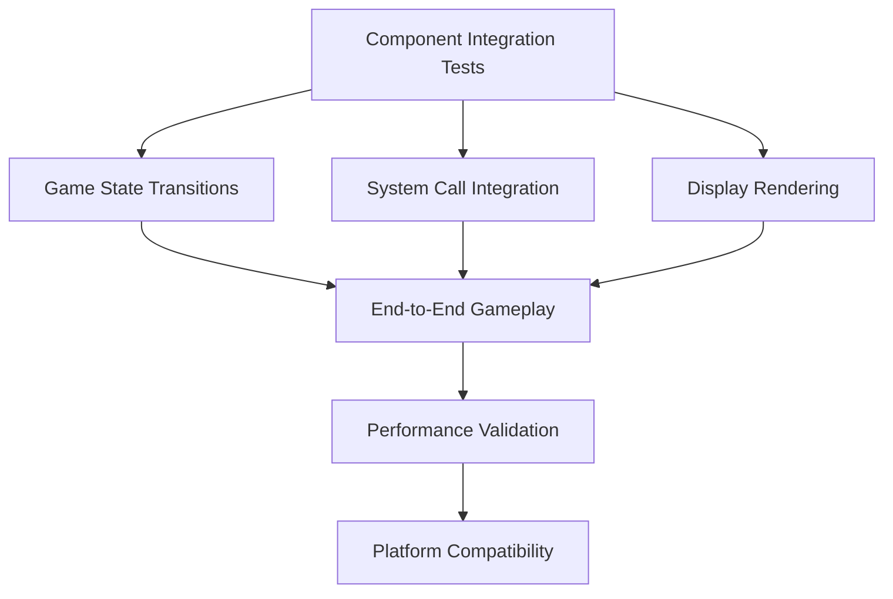
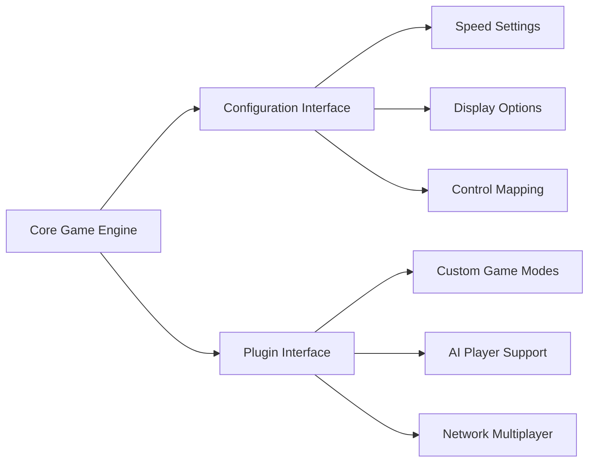

# Snake Game in ARM64 Assembly - Design Document

## Overview

The Snake Game is a classic arcade-style game implemented in ARM64 assembly language, designed to run natively on ARM-based Mac laptops (Apple Silicon M1/M2/M3). The game provides a retro gaming experience while demonstrating low-level programming concepts including direct memory management, system calls, and hardware-specific optimizations.

### Core Objectives
- Implement classic Snake gameplay mechanics in pure ARM64 assembly
- Utilize macOS system calls for terminal-based rendering
- Achieve optimal performance through direct hardware manipulation
- Demonstrate advanced assembly programming techniques
- Provide educational value for low-level programming concepts

### Target Platform
- **Hardware**: Apple Silicon (M1, M2, M3) Mac laptops
- **Operating System**: macOS 11.0+ (Big Sur and later)
- **Architecture**: ARM64 (AArch64)
- **Interface**: Terminal-based console application

## Architecture

### System Architecture Overview

### Component Architecture

| Component | Responsibility | Interface |
|-----------|---------------|-----------|
| **Display Manager** | Render game state to terminal | System call interface for terminal control |
| **Input Handler** | Process keyboard input | Raw terminal input processing |
| **Game Engine** | Core game logic coordination | State management interface |
| **Physics Engine** | Movement and collision detection | Position calculation interface |
| **Memory Manager** | Dynamic memory allocation | Custom heap management |
| **Timer System** | Game loop timing control | Precision timing interface |

## Game Logic Design

### Game State Management

The game operates through a finite state machine with the following states:

### Snake Movement System

| Property | Description | Implementation Strategy |
|----------|-------------|------------------------|
| **Direction Control** | Four-directional movement (Up, Down, Left, Right) | Direction vector storage with validation |
| **Body Segmentation** | Dynamic body length based on food consumption | Linked list structure in memory |
| **Movement Validation** | Prevent reverse direction movement | Direction change validation logic |
| **Speed Control** | Configurable movement speed | Timer-based movement intervals |

### Collision Detection Architecture

### Food Generation System

| Aspect | Design Decision | Rationale |
|--------|----------------|-----------|
| **Placement Algorithm** | Pseudo-random coordinates within play area | Ensures fair distribution while avoiding predictability |
| **Collision Avoidance** | Validate food placement against snake body | Prevents invalid game states |
| **Visual Representation** | Distinct character symbol in terminal | Clear visual distinction from snake body |
| **Regeneration Trigger** | Immediate regeneration upon consumption | Maintains continuous gameplay flow |

## Data Models & Memory Management

### Game Board Representation

| Structure | Type | Size | Purpose |
|-----------|------|------|---------|
| **Board Matrix** | 2D Character Array | 25x80 characters | Visual representation of game area |
| **Coordinate System** | X,Y Integer Pairs | 8 bytes per position | Position tracking system |
| **Boundary Definitions** | Static Integer Constants | 16 bytes | Wall collision boundaries |

### Snake Data Structure

### Memory Allocation Strategy

| Memory Region | Size | Usage | Management |
|---------------|------|-------|------------|
| **Static Data** | 4KB | Game constants and lookup tables | Compile-time allocation |
| **Game State** | 2KB | Current game variables | Stack allocation |
| **Snake Body** | Dynamic | Linked list of body segments | Heap allocation with custom allocator |
| **Display Buffer** | 8KB | Terminal rendering buffer | Pre-allocated static buffer |

## System Interface Layer

### macOS System Call Integration

| System Call | Purpose | Parameters | Return Value |
|-------------|---------|------------|--------------|
| **write()** | Display output to terminal | File descriptor, buffer, length | Bytes written |
| **read()** | Read keyboard input | File descriptor, buffer, length | Bytes read |
| **nanosleep()** | Game loop timing | Time specification structure | Success/error code |
| **ioctl()** | Terminal configuration | File descriptor, request, argument | Success/error code |

### Terminal Control Sequences

| Function | ANSI Sequence | Purpose |
|----------|---------------|---------|
| **Clear Screen** | ESC[2J | Initialize game display |
| **Cursor Position** | ESC[row;colH | Position game elements |
| **Hide Cursor** | ESC[?25l | Clean game appearance |
| **Color Control** | ESC[color;backgroundm | Visual game elements |

### Input Processing Architecture

## Performance Optimization

### ARM64-Specific Optimizations

| Optimization | Technique | Benefit |
|--------------|-----------|---------|
| **Register Utilization** | Use ARM64's 31 general-purpose registers efficiently | Minimize memory access overhead |
| **SIMD Instructions** | Leverage NEON for bulk operations | Accelerated collision detection |
| **Branch Prediction** | Optimize conditional jumps for common paths | Reduced pipeline stalls |
| **Cache Alignment** | Align data structures to cache line boundaries | Improved memory access patterns |

### Game Loop Optimization

## Testing Strategy

### Unit Testing Framework

| Test Category | Coverage | Validation Method |
|---------------|----------|-------------------|
| **Movement Logic** | All direction changes and boundary conditions | Automated position validation |
| **Collision Detection** | Wall, self, and food collision scenarios | State transition verification |
| **Memory Management** | Snake growth and dynamic allocation | Memory leak detection |
| **Input Processing** | All keyboard input combinations | Input response validation |

### Integration Testing

### Performance Testing Criteria

| Metric | Target | Measurement Method |
|--------|--------|--------------------|
| **Frame Rate** | 60 FPS sustained | Time measurement between frame renders |
| **Input Latency** | < 16ms | Time from keypress to state change |
| **Memory Usage** | < 1MB total | Memory profiling during extended gameplay |
| **CPU Usage** | < 5% of single core | System monitoring during gameplay |

## Configuration & Extensibility

### Game Configuration Parameters

| Parameter | Default Value | Range | Description |
|-----------|---------------|-------|-------------|
| **Board Width** | 80 characters | 40-120 | Horizontal game area size |
| **Board Height** | 25 characters | 20-40 | Vertical game area size |
| **Initial Speed** | 200ms per move | 50-500ms | Base movement interval |
| **Speed Acceleration** | 5ms per food | 0-20ms | Speed increase rate |
| **Initial Snake Length** | 3 segments | 1-10 | Starting snake size |

### Extensibility Design

