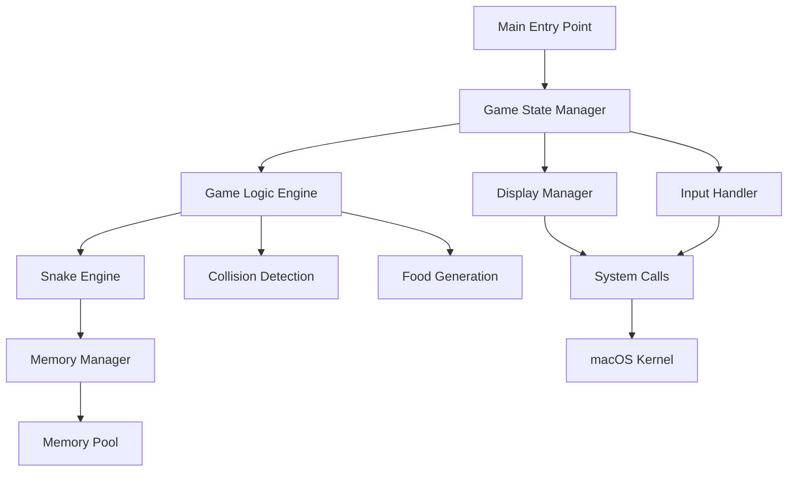
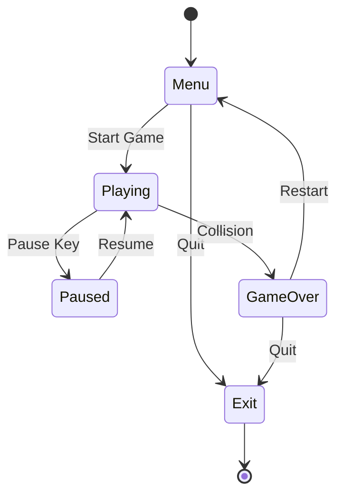

# Snake Game Architecture Documentation

## System Overview

The Snake Game is implemented as a modular system with clear separation of concerns. Each component handles a specific aspect of the game functionality while maintaining loose coupling with other components.

## Component Hierarchy



## Component Details

### 1. Main Entry Point (`main.s`)
- **Purpose**: Program initialization and main game loop
- **Responsibilities**:
  - System initialization
  - Frame rate control (60 FPS)
  - Main game loop execution
  - Cleanup on exit
- **Key Functions**:
  - `_start`: Program entry point
  - `_main_loop`: Core game loop with timing
  - `_main_init`: Initialize all subsystems
  - `_main_cleanup`: Cleanup resources

### 2. Game State Manager (`gamestate.s`)
- **Purpose**: Finite state machine for game flow
- **States**: Menu, Playing, Paused, Game Over, Exit
- **Responsibilities**:
  - State transitions
  - State-specific logic
  - Input delegation
- **Key Functions**:
  - `_game_state_manager_update`: Main state update
  - `_game_state_transition`: Handle state changes
  - `_state_*`: Individual state handlers

### 3. Game Logic Engine (`gamelogic.s`)
- **Purpose**: Core game mechanics and rules
- **Responsibilities**:
  - Snake movement logic
  - Collision detection
  - Food consumption
  - Score management
  - Speed progression
- **Key Functions**:
  - `_game_logic_update`: Main logic update
  - `_game_logic_move_snake`: Snake movement
  - `_game_logic_check_food`: Food collision
  - `_game_logic_increase_speed`: Speed progression

### 4. Snake Engine (`gamedata.s`)
- **Purpose**: Snake data structure and manipulation
- **Data Structure**: Linked list of body segments
- **Responsibilities**:
  - Snake initialization
  - Segment addition/removal
  - Position tracking
  - Growth management
- **Key Functions**:
  - `_snake_init`: Initialize snake
  - `_snake_add_segment`: Add new segment
  - `_snake_remove_tail`: Remove tail segment
  - `_snake_move`: Move entire snake

### 5. Display Manager (`display.s`)
- **Purpose**: Terminal rendering and visual output
- **Responsibilities**:
  - Screen clearing and setup
  - Color management
  - Text rendering
  - Cursor control
  - UI elements
- **Key Functions**:
  - `_display_render`: Main rendering function
  - `_display_snake`: Draw snake
  - `_display_food`: Draw food
  - `_set_color`: Manage colors

### 6. Input Handler (`input.s`)
- **Purpose**: Keyboard input processing
- **Responsibilities**:
  - Terminal raw mode setup
  - Non-blocking input
  - Key mapping
  - Direction validation
- **Key Functions**:
  - `_input_process`: Process keyboard input
  - `_terminal_raw_mode`: Setup raw terminal
  - `_input_map_key`: Map keys to actions

### 7. Memory Manager (`memory.s`)
- **Purpose**: Custom memory allocation
- **Strategy**: Linear allocator with 4KB pool
- **Responsibilities**:
  - Memory pool management
  - Allocation tracking
  - Memory alignment
  - Cleanup
- **Key Functions**:
  - `_memory_init`: Initialize pool
  - `_memory_alloc`: Allocate memory
  - `_memory_free`: Free memory
  - `_memory_cleanup`: Cleanup pool

### 8. System Calls (`syscalls.s`)
- **Purpose**: macOS system interface
- **Responsibilities**:
  - System call wrappers
  - Terminal I/O
  - Timing functions
  - Process control
- **Key Functions**:
  - `_sys_read`: Read system call
  - `_sys_write`: Write system call
  - `_sys_nanosleep`: Sleep function
  - `_print_string`: String output

## Data Flow

### Input Processing Flow
```
Keyboard → Raw Terminal → Input Buffer → Key Mapping → Game State → Direction Change
```

### Game Logic Flow
```
Timer → Movement Check → Snake Update → Collision Check → Board Update → Display
```

### Memory Flow
```
Allocation Request → Pool Check → Linear Allocation → Pointer Return → Usage Tracking
```

## State Transitions



## Memory Layout

### Game State Structure
```
Offset | Size | Field
-------|------|-------
0      | 8    | Current State
8      | 8    | Score  
16     | 8    | Direction
24     | 8    | Speed
32     | 8    | Paused Flag
40     | 8    | Snake Head Pointer
48     | 8    | Snake Tail Pointer
56     | 8    | Snake Length
64     | 8    | Food X
72     | 8    | Food Y
```

### Snake Node Structure
```
Offset | Size | Field
-------|------|-------
0      | 8    | X Coordinate
8      | 8    | Y Coordinate
16     | 8    | Next Pointer
```

## Performance Considerations

### Frame Rate Control
- Target: 60 FPS (16.67ms per frame)
- Adaptive timing based on processing time
- Frame dropping prevention
- Consistent game speed

### Memory Efficiency
- Linear allocation for cache performance
- 8-byte alignment for ARM64 optimization
- Minimal fragmentation
- Predictable allocation patterns

### Register Usage
- Efficient use of ARM64's 31 general registers
- Minimized memory access
- Register allocation optimization
- Function call conventions

## Error Handling

### Memory Errors
- Allocation failure detection
- Graceful degradation
- Pool exhaustion handling
- Cleanup on errors

### Input Errors
- Invalid key filtering
- Terminal setup failures
- Non-blocking I/O handling
- Signal interruption

### System Errors
- System call failures
- Terminal capability detection
- Resource cleanup
- Emergency exit procedures

## Debugging Support

### Debug Information
- Assembly symbol tables
- Line number information
- Register state tracking
- Memory allocation tracking

### Debugging Tools
- LLDB integration
- Memory leak detection
- Performance profiling
- Disassembly viewing

## Extension Points

### Adding New Features
1. **Power-ups**: Extend food generation system
2. **High Scores**: Add persistent storage
3. **Multiplayer**: Extend input handling
4. **Sound**: Add audio system calls
5. **Graphics**: Replace terminal with graphics

### Performance Optimizations
1. **SIMD**: Use NEON instructions for bulk operations
2. **Caching**: Implement board caching
3. **Prediction**: Add branch prediction hints
4. **Vectorization**: Optimize collision detection

## Testing Architecture

### Unit Tests
- Component isolation
- Function-level testing
- Mock system calls
- Memory validation

### Integration Tests
- End-to-end scenarios
- State transition validation
- Performance benchmarks
- Memory leak detection

## Build System

### Compilation Pipeline
```
Assembly Source → Object Files → Linking → Executable
```

### Makefile Targets
- `all`: Build complete game
- `test`: Run test suite
- `debug`: Debug build
- `clean`: Remove artifacts
- `install`: System installation

This architecture provides a solid foundation for a maintainable, performant, and extensible Snake game implementation in pure ARM64 assembly.